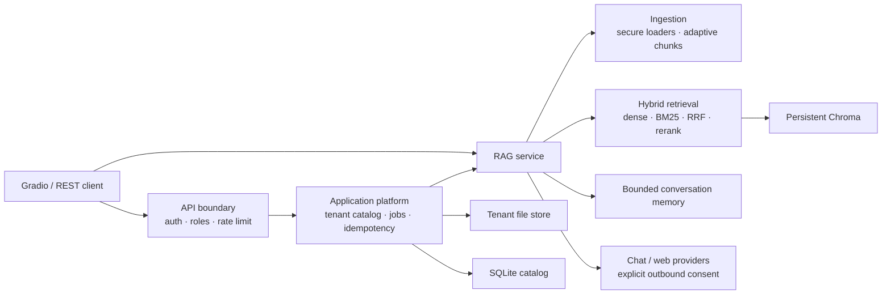

# RAG Studio

[](https://github.com/XWsight/RAG-Search-System/actions/workflows/quality.yml?query=branch%3Arag-studio)

面向中文知识库的隐私优先 RAG 系统：支持安全的多格式文档导入、向量与 BM25 混合检索、RRF 融合、可选重排序、证据路由、联网补充、带引用回答和有预算上限的研究模式。

仓库同时提供两个入口：适合本地体验的 Gradio 工作台，以及具备租户隔离、鉴权、后台索引任务、持久化目录、限流、指标和安全错误协议的 FastAPI 服务。`main` 保留原始 V1.0；当前增强版位于 `rag-studio` 分支。

> 当前生产形态是 **durable single-node**，不是多副本高可用集群。SQLite、Chroma 和上传原文必须位于同一个持久卷，API 只能运行一个 Uvicorn worker。能力边界详见[部署说明](docs/deployment.md)。

## 核心能力

| 领域 | 已实现能力 |
| --- | --- |
| 文档摄取 | TXT、Markdown、HTML、DOCX、PDF；大小、页数、字符数、压缩包膨胀和路径安全边界 |
| 检索 | 中文 Embedding、Chroma 余弦检索、BM25、RRF 融合、来源多样化、可选 CrossEncoder 重排序 |
| 回答 | 本地 / 混合 / 网络 / 拒答路由；请求级云端与联网授权；引用白名单审计 |
| 研究模式 | 有界查询拆解、多查询检索融合、多次网络补充；无无限 ReAct 循环 |
| 会话 | TTL、LRU、轮数与字符数上限；租户、知识库和浏览器会话三重隔离 |
| 数据生命周期 | 原子上传、SHA-256 清单校验、持久索引复用、残缺集合重建、耐久取消意图、显式删除 |
| 服务边界 | API Key / Bearer、reader / writer / operator、租户隔离、持久幂等、后台任务、限流 |
| 可运维性 | liveness/readiness、隐私安全 JSON 事件、Prometheus 指标、Docker Compose、备份恢复手册 |
| 质量 | 离线 Recall/MRR/nDCG、路由与引用指标、阈值校准、Python 3.11/3.12 CI、依赖审计 |

## 架构



索引身份包含租户命名空间、文档内容、切分参数和 Embedding 模型。同一知识库在进程重启后可重新挂载已有向量；不同租户上传完全相同的文件也不会共享索引身份。

更完整的数据流、模块边界和非目标见[架构文档](docs/architecture.md)。

## 本地工作台

要求 Python 3.11 或 3.12。Windows PowerShell：

```powershell
git clone https://github.com/XWsight/RAG-Search-System.git
cd RAG-Search-System
git switch rag-studio

py -3.11 -m venv .venv
Set-ExecutionPolicy -Scope Process -ExecutionPolicy RemoteSigned
.\.venv\Scripts\Activate.ps1
python -m pip install -r requirements.txt
Copy-Item .env.example .env
```

如果需要云端生成或联网搜索，再在 `.env` 中配置：

```dotenv
ZHIPU_API_KEY=你的智谱密钥
ZHIPU_MODEL=glm-5.2
```

不配置密钥也能使用本地检索模式。`RAG_ALLOW_CLOUD_DEFAULT` 与 `RAG_ALLOW_WEB_DEFAULT` 只控制 Gradio 界面的初始勾选状态；REST API 始终要求每次请求显式授权。关闭时，问题与文档证据不会被发送到相应外部服务。

运行：

```powershell
$env:NO_PROXY = "127.0.0.1,localhost"
$env:no_proxy = "127.0.0.1,localhost"
python app.py
```

访问 `http://127.0.0.1:7860`。首次使用默认 Embedding 模型时需要下载模型文件。

## 持久化 API

在 `.env` 中使用高熵 API Key 配置租户主体，并启用持久化：

```dotenv
RAG_PERSIST_DATA=true
RAG_STORAGE_ROOT=.rag_data
RAG_API_KEYS_JSON={"替换为至少16字符的随机密钥":{"subject":"local-admin","tenant_id":"local","roles":["reader","writer","operator"]}}
```

启动单 worker 服务：

```powershell
python -m uvicorn api_app:app --host 127.0.0.1 --port 8000 --workers 1
```

主要端点：

| 方法 | 路径 | 角色 | 用途 |
| --- | --- | --- | --- |
| `GET` | `/health/live`, `/health/ready` | 公开 | 存活与就绪检查 |
| `POST` | `/v1/knowledge-bases` | writer | 上传并异步建立知识库，需要 `Idempotency-Key` |
| `GET` | `/v1/knowledge-bases` | reader | 列出本租户知识库 |
| `GET/DELETE` | `/v1/knowledge-bases/{id}` | reader / writer | 查询或完整删除资源 |
| `GET/DELETE` | `/v1/jobs/{id}` | reader / writer | 查询或取消后台任务 |
| `POST` | `/v1/answers` | reader | 检索、路由并回答 |
| `DELETE` | `/v1/knowledge-bases/{id}/sessions/{session}` | writer | 清除一段对话记忆 |
| `GET` | `/metrics` | operator | Prometheus 文本指标 |

每个受保护请求只能提供一种认证方式：`X-API-Key` 或 `Authorization: Bearer`。`Idempotency-Key` 必须是 8–128 个可打印 ASCII 字符；在 24 小时有效窗口内，相同键与相同请求会返回原资源，同一键绑定不同请求会安全地返回冲突。窗口过期后，该键会被视为新的创建请求。

索引取消采用两层状态：平台会先把可取消知识库的 Catalog 状态从 `PENDING`/`INDEXING` 耐久写为 `CANCELLING`，成功后才向进程内 worker 发出取消信号。意图写入失败时 API 返回 `503`、worker 不会收到信号，调用方应使用同一 job ID 重试。排队 job 可能立即变为 `cancelled`；运行中 job 先变为 `cancelling`，只有 worker 实际退出后才释放任务容量。知识库通常收敛为 `FAILED`/`index_cancelled`；若终态写入中断，启动恢复或同一创建请求的幂等重放会完成收敛，并为重放返回新的可轮询 job，旧 job ID 本身不会恢复。

如果知识库已经耐久提交为 `READY`，取消请求已经太迟：Catalog 保持 `READY`，job 可能短暂显示 `cancelling`，但已完成的任务最终记为 `succeeded`。Catalog 当前使用 schema v3；启动时会在事务内把 schema v2 迁移到 v3，以容纳耐久 `CANCELLING` 状态。升级前仍须停写备份；旧程序不能直接读取迁移后的 v3 Catalog。

`ready` 验证文档存储根、Catalog 和进程内 JobManager 状态；它不探测可选模型、Chroma 查询或外部供应商。调用方仍需处理单次检索、模型下载或上游服务失败。

OpenAPI 默认位于 `http://127.0.0.1:8000/docs`；生产环境可设置 `RAG_API_DOCS_ENABLED=false`。

## Docker 部署

```bash
cp .env.example .env
# 编辑 .env 后：
docker compose config --quiet
docker compose build --pull
docker compose up -d
curl --fail http://127.0.0.1:8000/health/ready
```

Compose 默认仅发布到 `127.0.0.1`，使用非 root 用户、只读容器根文件系统、最小权限、资源上限、日志轮转和 `/data` 持久卷。公网访问必须由可信反向代理终止 TLS。备份、恢复、升级、回滚、密钥轮换和删除要求见[部署说明](docs/deployment.md)与[运维手册](docs/operations.md)。

## 验证与评测

```powershell
python -m unittest discover -s tests -v
python -m compileall -q rag_system tests scripts
python scripts\benchmark_sparse.py evals\retrieval_cases.jsonl `
  evals\corpus\rag.md evals\corpus\retrieval.md `
  evals\corpus\safety.md evals\corpus\storage.md
```

当前 12 题开发集上的依赖无关 BM25 冒烟基线为 Recall@5 `1.0000`、MRR@5 `0.9500`、nDCG@5 `0.9631`、路由准确率 `0.7500`。这个小型、仓库内开发集只用于回归，**不能外推为真实业务效果**，引用指标也不适用于该检索集。

真实混合检索需要安装运行依赖后执行：

```powershell
python scripts\benchmark_retrieval.py evals\retrieval_cases.jsonl `
  evals\corpus\rag.md evals\corpus\retrieval.md `
  evals\corpus\safety.md evals\corpus\storage.md
```

评测协议、数据泄漏防范与阈值校准见[评测文档](docs/evaluation.md)。仓库中的 `evals/sample_dataset.jsonl` 是评测格式夹具，不是系统性能证明。

## 项目结构

```text
rag_system/
  api.py              # REST 边界、鉴权、角色、限流和安全错误协议
  platform.py         # 多租户资源、后台任务与数据生命周期编排
  catalog.py          # SQLite 知识库目录与状态机
  idempotency.py      # 持久化幂等 reservation
  file_store.py       # 租户隔离、原子且有界的上传存储
  ingestion.py        # 安全文档加载与确定性切分
  retrieval.py        # Chroma、混合检索、路由和索引持久化
  service.py          # 问答、联网、研究模式、引用和会话编排
  metrics.py          # 有界 Prometheus 指标
  observability.py    # 不记录问题/文档正文的结构化事件
evals/                # 标注检索集与离线评测夹具
scripts/              # 基准、校准和质量检查入口
tests/                # 单元、隔离、并发、故障与 API 契约测试
```

## 安全与边界

- 上传内容、网络摘要和检索片段全部视为不可信数据；系统提示明确禁止执行证据中的指令。
- API 不回显供应商响应体、内部路径、租户 ID、内部索引 ID、问题正文或文档正文到日志。
- 网络搜索会发送问题，云端生成会发送问题与选中证据；两条出站路径分别授权。
- 会话、任务队列、job 快照/ID 和限流状态仍为进程内状态；重启会重新提交 `PENDING`/`INDEXING`，并把耐久 `CANCELLING` 收敛为 `FAILED`/`index_cancelled`，但不会恢复原任务或原 job ID，也不是分布式任务系统。
- “删除”是应用层逻辑删除与文件删除，不等于 SSD、快照和离线备份的介质级不可恢复擦除。

威胁模型、残余风险和安全报告流程见[安全设计](docs/security.md)与[安全策略](SECURITY.md)。

> 依赖边界：当前 Chroma 上游尚无针对 `PYSEC-2026-311` 的修复版本。本项目仅支持嵌入式
> `PersistentClient`，不得运行或暴露 Chroma Server；精确、会到期的风险例外及补偿控制见
> [依赖与供应链](docs/security.md#依赖与供应链)。

## 当前非目标

- 多副本写入、跨可用区容灾和零停机滚动升级
- 任意代码执行、自动训练或无边界自主工具循环
- 未经人工评审的自动科研结论或自动投稿
- 用代码行数、测试数量或开发集得分代替真实负载与领域验收

下一阶段的规模化路径是把目录、向量服务、任务队列、会话和限流依次迁移到外置共享基础设施，并先补齐迁移工具、故障演练和多租户负载测试。

## 贡献与许可

版本变化见 [CHANGELOG.md](CHANGELOG.md)，贡献流程见 [CONTRIBUTING.md](CONTRIBUTING.md)。本仓库目前尚未选择开源许可证；在许可证明确前，请不要假设获得复制、修改或再分发授权。
